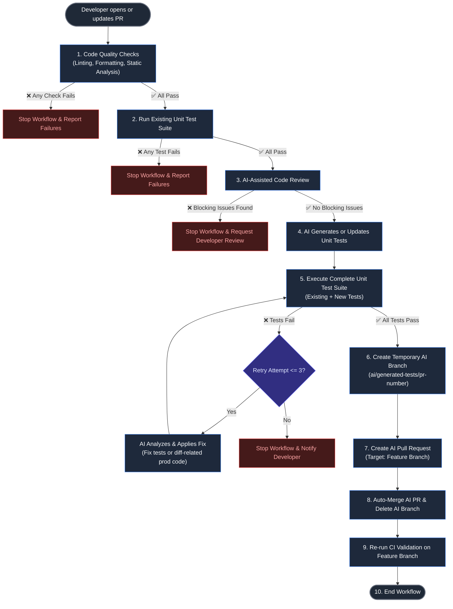

# AI-Assisted Unit Test Generation Workflow

## Objective

Automatically generate and validate unit tests for code changes while ensuring code quality. The workflow should stop immediately if any validation step fails. When all validation succeeds, the AI should generate unit tests in a temporary branch, create a pull request, and automatically merge those changes back into the developer's feature branch. This updates the developer's original pull request with the generated tests while maintaining a clear audit trail.

---

# Workflow

## Visual Workflow Diagram



## Detailed Text Workflow

```text
Developer opens or updates a Pull Request
                │
                ▼
1. Run code quality checks
   - Linting
   - Formatting
   - Static analysis (optional)

   ❌ If any check fails:
      → Stop the workflow.
      → Report failures to the developer.

                │
                ▼
2. Run the existing unit test suite

   ❌ If any test fails:
      → Stop the workflow.
      → Report failures to the developer.

                │
                ▼
3. Perform AI-assisted code review

   The AI reviews only the files included in the pull request and checks for:
   - Potential bugs
   - Security issues
   - Code smells
   - Missing edge cases
   - Style violations

   ❌ If blocking issues are found:
      → Stop the workflow.
      → Request developer review.

                │
                ▼
4. Generate or update unit tests

   The AI should:
   - Analyze only the code changes (diff).
   - Generate new unit tests where coverage is missing.
   - Update existing tests only when necessary.
   - Avoid modifying unrelated test files.

                │
                ▼
5. Execute the complete unit test suite

   Run:
   - Existing tests
   - Newly generated tests

   ✅ If all tests pass:
      Continue.

   ❌ If tests fail:

      The AI may attempt automated fixes with the following constraints:

      - Maximum of 3 retry attempts.
      - Classify each failure as either:
        - Test bug
        - Production code defect

      The AI may:
      - Fix generated tests if they are incorrect.
      - Fix implementation code only when the issue is directly caused by the submitted changes.

      The AI must NOT:
      - Remove assertions.
      - Weaken assertions.
      - Disable or skip tests.
      - Reduce coverage simply to obtain a passing build.

      If failures remain after the retry limit:
      → Stop the workflow.
      → Notify the developer for manual intervention.

                │
                ▼
6. Create an AI-generated test branch

   Create a temporary branch from the developer's feature branch.

   Example:

   ai/generated-tests/<pr-number>

   Commit only:
   - Newly generated unit tests
   - Updated unit tests
   - Minimal implementation changes required to make valid tests pass (if applicable)

                │
                ▼
7. Create an AI Pull Request

   Source branch:
   ai/generated-tests/<pr-number>

   Target branch:
   Developer's feature branch

   The AI PR should include:
   - Summary of generated tests
   - Files modified
   - Retry attempts performed
   - Test execution results
   - Coverage improvements (if available)

                │
                ▼
8. Automatically merge the AI Pull Request

   If all required checks succeed:

   - Merge the AI PR into the developer's feature branch.
   - Delete the temporary AI branch after the merge.

   This automatically updates the developer's original pull request with the AI-generated test changes.

                │
                ▼
9. Re-run CI validation

   Execute all required validation checks again on the updated developer branch to ensure the merged AI changes remain valid.

                │
                ▼
10. End workflow
```

---

# Workflow Rules

## AI Scope

The AI must operate only on files affected by the current pull request.

It must never:

- Refactor unrelated code.
- Modify unrelated tests.
- Change project configuration.
- Introduce new dependencies unless explicitly approved.

---

## Retry Policy

| Item | Value |
|------|-------|
| Maximum retries | 3 |
| Retry target | Generated tests and related implementation only |
| Retry condition | Unit test failures |
| Stop condition | Retry limit exceeded |

---

## Failure Conditions

Terminate the workflow immediately if any of the following occur:

- Formatting fails.
- Linting fails.
- Existing unit tests fail.
- AI code review identifies blocking issues.
- AI cannot resolve test failures within the retry limit.
- The AI pull request cannot be merged automatically.

---

## Success Criteria

The workflow is considered successful when:

- All code quality checks pass.
- Existing unit tests pass.
- AI review finds no blocking issues.
- Generated tests compile successfully.
- All unit tests pass.
- The AI pull request is successfully merged into the developer's feature branch.
- The developer's original pull request is automatically updated with the generated test changes.

---

# Expected GitHub Actions Jobs

1. Checkout repository
2. Install dependencies
3. Run formatter
4. Run linter
5. Run existing unit tests
6. AI-assisted code review
7. AI generate/update unit tests
8. Run complete unit test suite
9. AI retry loop (maximum 3 attempts)
10. Create temporary AI branch
11. Commit generated tests
12. Push AI branch
13. Create AI pull request
14. Wait for required checks
15. Auto-merge AI pull request into the developer's feature branch
16. Delete temporary AI branch
17. Re-run CI on the updated developer branch
18. Publish workflow summary

---

# Guiding Principles

- Fail fast.
- Preserve the developer's intent.
- Generate tests only for the current code changes.
- Keep AI modifications minimal, deterministic, and traceable.
- Never weaken or remove tests to achieve a passing build.
- Require human intervention whenever the AI cannot confidently resolve failures.
- Maintain a complete audit trail by creating and merging a dedicated AI pull request instead of pushing directly to the developer's branch.